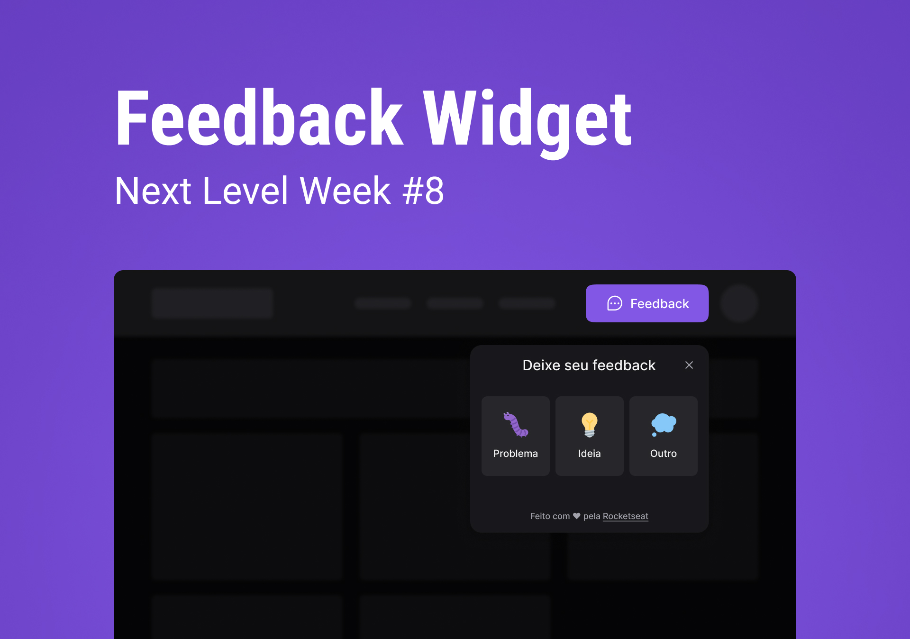

	<a href="#-tecnologias">Tecnologias</a>&nbsp;&nbsp;&nbsp;|&nbsp;&nbsp;&nbsp;
  <a href="#-projeto">Projeto</a>&nbsp;&nbsp;&nbsp;|&nbsp;&nbsp;&nbsp;
  <a href="#-layout">Layout</a>&nbsp;&nbsp;&nbsp;|&nbsp;&nbsp;&nbsp;
  <a href="#memo-licença">Licença</a>

 

	

## 🛠 Technologies

This project was development with the technologies:

- ReactJS
- TailwindCSS
- Phosphor UI
- Headless UI

### 💻 Project

Feedget is a widget creator of feedback for sites. Using accessibility and responsibility.

## 🔖 Layout

You can visibility layout of project in [site](https://www.figma.com/community/file/1102912516166573468/Feedback-Widget)
